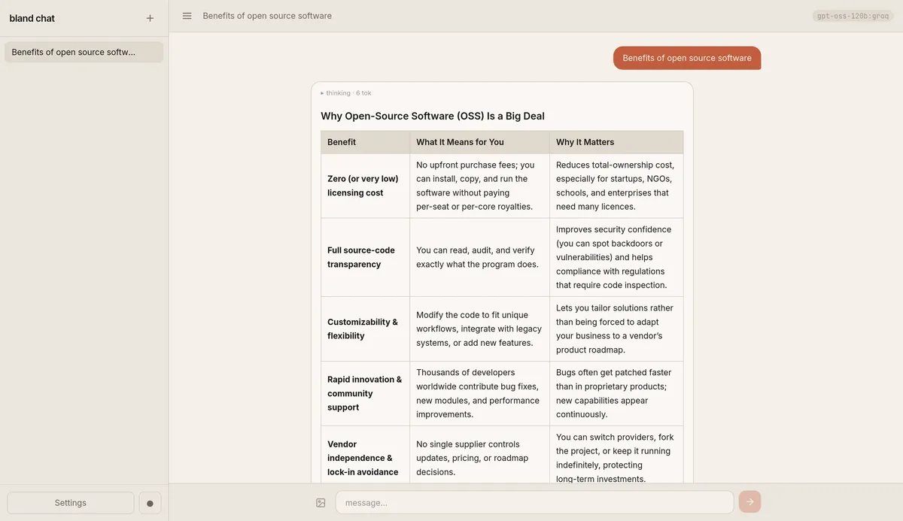
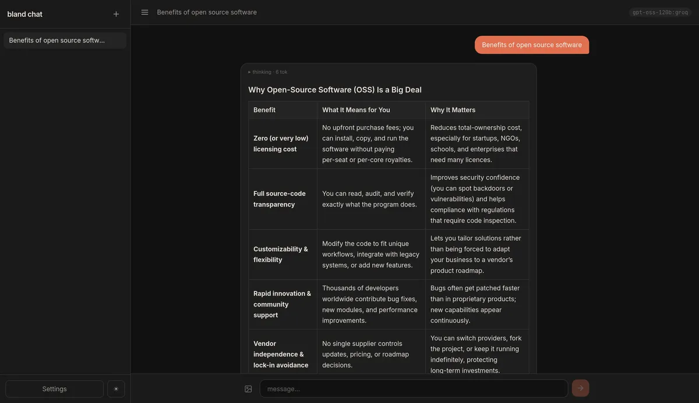
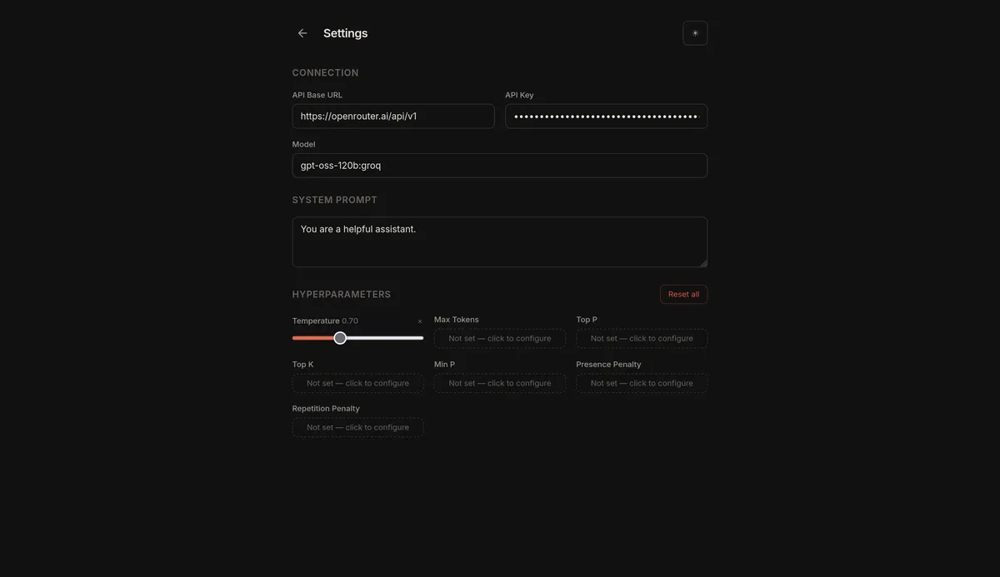

# bland-chat

A minimal, self-hosted chat UI for OpenAI-compatible APIs, built with SvelteKit and Bun.





## Features

- Connects to any OpenAI-compatible API endpoint (OpenAI, Ollama, LM Studio, etc.)
- Persistent chat history stored in a local SQLite database
- No external services required — everything runs locally

## Development

Install dependencies and start the dev server:

```sh
bun install
bun run dev
```

Copy `.env.example` to `.env` and optionally set default API details that will be pre-filled in the UI on first load:

```sh
cp .env.example .env
```

| Variable       | Default                      | Description                                    |
|----------------|------------------------------|------------------------------------------------|
| `VITE_API_URL` | `https://api.openai.com/v1`  | Pre-filled API base URL (build-time, optional) |
| `VITE_API_KEY` | _(empty)_                    | Pre-filled API key (build-time, optional)      |
| `VITE_MODEL`   | `gpt-4o`                     | Pre-filled model name (build-time, optional)   |

> **Note:** `VITE_*` variables are embedded into the client bundle by Vite at build time. They serve only as UI defaults on first load — after that, settings are persisted in the database. They cannot be changed at runtime without rebuilding.

## Building

```sh
bun run build
```

## Docker

Images are published to `ghcr.io/aunali321/bland-chat` via GitHub Actions on every push to `main` and on version tags.

```sh
docker compose up -d
```

Mount a volume at `/app/data` to persist the SQLite database across restarts (the included `docker-compose.yml` handles this automatically).

| Variable        | Default                        | Description                      |
|-----------------|--------------------------------|----------------------------------|
| `HOST`          | `0.0.0.0`                      | Interface to listen on           |
| `PORT`          | `3000`                         | Port to listen on                |
| `DATABASE_PATH` | `/app/data/bland-chat.sqlite`  | Path to the SQLite database file |
